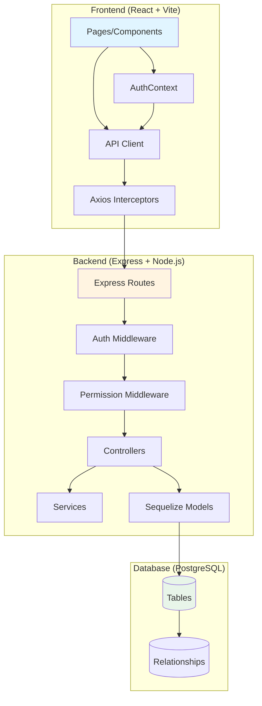

# AifyMS ERP System - Architecture Context Map

**Version:** 1.0.0  
**Last Updated:** 2025-01-27  
**Purpose:** Cognitive map for LLM understanding of system architecture, data flow, and key patterns

---

## System Architecture Overview

```
┌─────────────────────────────────────────────────────────────────┐
│                         CLIENT LAYER                            │
│  ┌──────────────────────────────────────────────────────────┐  │
│  │  React 18 (Vite) Frontend                                │  │
│  │  - Pages: Dashboard, POS, Inventory, Payments, etc.      │  │
│  │  - Components: Layout, Forms, Modals                     │  │
│  │  - Context: AuthContext (User, Permissions)              │  │
│  │  - Utils: API Client (Axios with interceptors)           │  │
│  └──────────────────────────────────────────────────────────┘  │
└─────────────────────────────────────────────────────────────────┘
                              │
                              │ HTTP/REST (JWT Bearer Token)
                              │ /api/*
                              ▼
┌─────────────────────────────────────────────────────────────────┐
│                        API LAYER                                │
│  ┌──────────────────────────────────────────────────────────┐  │
│  │  Express.js Backend (Node.js)                            │  │
│  │  - Routes: /auth, /products, /inventory, /sales, etc.    │  │
│  │  - Controllers: Business logic handlers                  │  │
│  │  - Middleware: authMiddleware, permissionMiddleware      │  │
│  │  - Services: Import/Export, Business logic               │  │
│  └──────────────────────────────────────────────────────────┘  │
└─────────────────────────────────────────────────────────────────┘
                              │
                              │ Sequelize ORM
                              │ Model Queries
                              ▼
┌─────────────────────────────────────────────────────────────────┐
│                      DATA LAYER                                 │
│  ┌──────────────────────────────────────────────────────────┐  │
│  │  PostgreSQL 15+ Database                                 │  │
│  │  - Tables: users, products, sales_orders, etc.           │  │
│  │  - Relationships: Foreign keys, Many-to-Many             │  │
│  │  - Enums: product_type, payment_status, etc.             │  │
│  └──────────────────────────────────────────────────────────┘  │
└─────────────────────────────────────────────────────────────────┘
```

### Mermaid Architecture Diagram



---

## Data Flow Explanations

### 1. Authentication Flow

**Path:** `Login.jsx` → `AuthContext.login()` → `POST /api/auth/login` → `authController.login()` → Database → JWT Token

**Detailed Steps:**
1. User enters credentials in `frontend/src/pages/Login.jsx`
2. Form submission calls `AuthContext.login(email, password)`
3. `AuthContext` uses `api.post('/auth/login', { email, password })` from `frontend/src/utils/api.js`
4. Axios interceptor adds `Content-Type: application/json` header
5. Request reaches `backend/src/routes/authRoutes.js` → `POST /api/auth/login`
6. `backend/src/controllers/authController.js` → `login()` function:
   - Validates email/password presence
   - Queries `User` model with `Role` and `Permission` includes
   - Calls `user.checkPassword(password)` (bcrypt comparison)
   - Generates JWT token using `jwt.sign({ userId, email }, JWT_SECRET)`
   - Returns `{ token, user: { id, email, full_name, role, permissions, branch } }`
7. Frontend receives response:
   - Stores token in `localStorage.setItem('token', token)`
   - Stores user data in `localStorage.setItem('user', JSON.stringify(userData))`
   - Updates `AuthContext` state with user and permissions
   - Redirects to Dashboard

**JWT Token Structure:**
- Payload: `{ userId: UUID, email: string }`
- Expires: 7 days (configurable via `JWT_EXPIRES_IN`)
- Secret: Stored in `JWT_SECRET` environment variable

---

### 2. API Request Flow (Authenticated)

**Path:** Component → `api.get/post/put/delete()` → Axios Interceptor → Express Route → Middleware → Controller → Sequelize → Database

**Detailed Steps:**
1. **Frontend Component** calls `api.get('/products')` or similar
2. **Axios Request Interceptor** (`frontend/src/utils/api.js`):
   - Retrieves token from `localStorage.getItem('token')`
   - Adds header: `Authorization: Bearer <token>`
   - Sets `Content-Type: application/json`
3. **Express Server** (`backend/server.js`):
   - Receives request at `/api/*`
   - Routes to appropriate route file via `backend/src/routes/index.js`
4. **Route Handler** (e.g., `backend/src/routes/productRoutes.js`):
   - Applies `authenticate` middleware
   - Applies `requirePermission` middleware (if needed)
   - Routes to controller function
5. **Auth Middleware** (`backend/src/middleware/authMiddleware.js`):
   - Extracts token from `Authorization: Bearer <token>` header
   - Verifies JWT using `jwt.verify(token, JWT_SECRET)`
   - Queries database for user with role and permissions
   - Attaches `req.user = { id, email, role_id, branch_id, permissions: [...] }`
   - Calls `next()` if valid, returns 401 if invalid
6. **Permission Middleware** (`backend/src/middleware/permissionMiddleware.js`):
   - Checks if `req.user.permissions` includes required permission slug
   - Super Admin bypasses all permission checks
   - Returns 403 if permission denied
7. **Controller** (e.g., `backend/src/controllers/productController.js`):
   - Uses `req.user` for branch filtering and authorization
   - Calls Sequelize model methods (e.g., `Product.findAll({ where: { branch_id } })`)
   - Returns JSON response
8. **Axios Response Interceptor**:
   - On 401: Clears localStorage and redirects to `/login`
   - On success: Returns response data to component
9. **Component** receives data and updates UI

---

### 3. Permission-Based Access Control Flow

**Path:** Component → `useAuth().hasPermission()` → Route Protection → API Permission Check

**Frontend Permission Check:**
- `frontend/src/context/AuthContext.jsx` provides `hasPermission(slug)` function
- Components call `const { hasPermission } = useAuth()`
- UI elements conditionally render: `{hasPermission('product_edit') && <EditButton />}`
- `ProtectedRoute` component can check permissions before rendering pages

**Backend Permission Check:**
- Routes use `requirePermission('product_edit')` middleware
- Middleware checks `req.user.permissions.includes('product_edit')`
- Super Admin role bypasses all checks (returns true for all permissions)
- Returns 403 Forbidden if permission denied

**Permission Structure:**
- 37 total permissions organized into groups:
  - `user_management`: user_view, user_add, user_edit, etc.
  - `inventory`: product_view, product_add, stock_adjust, etc.
  - `sales_pos`: pos_access, sale_view_all, sale_edit_price, etc.
  - `payments`: payment_view, payment_receive, payment_confirm, etc.
  - `manufacturing`: recipe_view, recipe_manage, production_view_queue, etc.
  - `data_management`: data_import, data_export_operational, etc.
  - `reports`: report_view_register, report_view_financial, etc.

---

### 4. Multi-Branch Data Isolation

**Pattern:** All data queries filter by `branch_id` from `req.user.branch_id`

**Implementation:**
- Users belong to a `Branch` (except Super Admin with `branch_id = NULL`)
- Controllers automatically filter queries: `Product.findAll({ where: { branch_id: req.user.branch_id } })`
- Super Admin can view all branches (no branch filter applied)
- Stock transfers require approval and track `from_branch_id` and `to_branch_id`
- Sales orders are scoped to user's branch

**Example Flow:**
1. User logs in → `req.user.branch_id = 'uuid-of-lagos-branch'`
2. Inventory query: `InventoryInstance.findAll({ where: { branch_id: req.user.branch_id } })`
3. Only shows inventory for Lagos branch
4. Super Admin: `branch_id = null` → No filter → Shows all branches

---

### 5. Inventory Instance Tracking (Coils/Pallets)

**Unique Feature:** Tracks individual physical items (coils, pallets) with unique instance codes

**Data Flow:**
1. **Register Coil:** `POST /api/inventory/instances`
   - Creates `InventoryInstance` with `instance_code` (e.g., "COIL-001")
   - Links to `Product` (type: `raw_tracked`)
   - Sets `initial_quantity` and `remaining_quantity`
   - Associates with `Branch`

2. **Sale with Coil Selection:**
   - User creates sales order with manufactured product (e.g., "Longspan 0.55")
   - System checks `Recipe` for conversion (1 Meter = 0.8 KG)
   - User must select specific `InventoryInstance` (coil) to deduct from
   - Creates `ItemAssignment` linking `SalesItem` → `InventoryInstance`
   - Deducts `quantity_deducted` from `InventoryInstance.remaining_quantity`

3. **Stock Transfer:**
   - Creates `StockTransfer` record
   - Updates `InventoryInstance.branch_id` to destination branch
   - Requires approval for inter-branch transfers

**Key Tables:**
- `inventory_instances`: Physical items with unique codes
- `item_assignments`: Links sales items to specific inventory instances
- `stock_transfers`: Tracks movement between branches
- `stock_adjustments`: Records quantity corrections with reasons

---

## Technology Stack

### Frontend
- **Framework:** React 18 with Vite
- **Styling:** Tailwind CSS
- **State Management:** React Context API (AuthContext)
- **Data Fetching:** React Query (TanStack Query)
- **HTTP Client:** Axios with interceptors
- **Routing:** React Router v6
- **Build Tool:** Vite
- **Port:** 5173

### Backend
- **Runtime:** Node.js
- **Framework:** Express.js
- **ORM:** Sequelize
- **Authentication:** JWT (jsonwebtoken)
- **Password Hashing:** bcrypt
- **Validation:** Express built-in + custom
- **Port:** 5000

### Database
- **Engine:** PostgreSQL 15+
- **Connection:** Sequelize ORM
- **Port:** 5432
- **Database Name:** aify_erp
- **Schema Management:** `database/init.sql` (manual, not auto-sync)

### Infrastructure
- **Containerization:** Docker & Docker Compose
- **Network:** Bridge network (`aify-network`)
- **Volumes:** Persistent PostgreSQL data volume

---

## Key Database Models & Relationships

### Core Models
- **User** → belongsTo Role, Branch
- **Role** → belongsToMany Permission (through `role_permissions`)
- **Permission** → belongsToMany Role
- **Branch** → hasMany User, SalesOrder, InventoryInstance
- **Product** → hasMany InventoryInstance, SalesItem, Recipe
- **InventoryInstance** → belongsTo Product, Branch; hasMany ItemAssignment
- **SalesOrder** → belongsTo Customer, Branch, User; hasMany SalesItem
- **SalesItem** → belongsTo SalesOrder, Product; hasMany ItemAssignment
- **ItemAssignment** → belongsTo SalesItem, InventoryInstance
- **Recipe** → belongsTo Product (virtual_product, raw_product)
- **Payment** → belongsTo Customer, User (created_by, confirmed_by)
- **StockTransfer** → belongsTo InventoryInstance, Branch (from/to), User
- **StockAdjustment** → belongsTo InventoryInstance, User
- **Wastage** → belongsTo InventoryInstance, User

### Product Types (Enum)
- `standard`: Regular products
- `compound`: Products with compound units
- `raw_tracked`: Raw materials tracked by instance (coils/pallets)
- `manufactured_virtual`: Virtual products created from recipes

### Production Status (Enum)
- `queue`: Waiting for production
- `produced`: Production completed
- `delivered`: Delivered to customer
- `na`: Not applicable (standard products)

---

## Key Architectural Patterns

### 1. JWT Authentication with Bearer Tokens
- Token stored in localStorage (frontend)
- Sent in `Authorization: Bearer <token>` header
- Token contains `userId` and `email`
- User data (role, permissions) fetched on each request (not in token)
- Token expiration: 7 days

### 2. Permission Middleware Chain
```
Request → authenticate → requirePermission → Controller
```
- `authenticate`: Verifies JWT and loads user with permissions
- `requirePermission`: Checks specific permission slug
- Super Admin bypasses permission checks

### 3. Branch-Based Data Isolation
- All queries filter by `req.user.branch_id`
- Super Admin (`branch_id = null`) sees all data
- Stock transfers require explicit branch tracking

### 4. Inventory Instance Tracking
- Physical items (coils/pallets) have unique `instance_code`
- Sales link to specific instances via `ItemAssignment`
- Enables granular inventory tracking and material traceability

### 5. Manufacturing Workflow
- Sales of `manufactured_virtual` products trigger production queue
- Recipes define conversion factors (e.g., 1 Meter = 0.8 KG)
- Production status: `queue` → `produced` → `delivered`
- Material reservation happens at point of sale (coil selection)

### 6. Maker-Checker Workflow (Payments)
- Cashier logs payment → Status: `pending_confirmation`
- Manager confirms payment → Status: `confirmed` → Ledger updated
- Prevents unauthorized financial transactions

---

## API Endpoint Structure

### Base URL: `/api`

**Authentication:**
- `POST /api/auth/login` - User login
- `POST /api/auth/logout` - User logout (future)

**Products:**
- `GET /api/products` - List products (branch-filtered)
- `POST /api/products` - Create product
- `PUT /api/products/:id` - Update product
- `DELETE /api/products/:id` - Delete product

**Inventory:**
- `GET /api/inventory/instances` - List inventory instances
- `POST /api/inventory/instances` - Register new coil/pallet
- `POST /api/inventory/transfer` - Transfer stock between branches
- `POST /api/inventory/adjust` - Adjust stock with reason

**Sales:**
- `GET /api/sales/orders` - List sales orders
- `POST /api/sales/orders` - Create sales order (POS)
- `GET /api/sales/orders/:id` - Get sales order details

**Payments:**
- `GET /api/payments` - List payments
- `POST /api/payments` - Log payment (pending confirmation)
- `PUT /api/payments/:id/confirm` - Confirm payment

**Recipes:**
- `GET /api/recipes` - List recipes
- `POST /api/recipes` - Create recipe
- `PUT /api/recipes/:id` - Update recipe

**Attributes:**
- `GET /api/attributes/brands` - List brands
- `POST /api/attributes/brands` - Create brand
- Similar for colors, gauges

**Branches:**
- `GET /api/branches` - List branches

**Import/Export:**
- `POST /api/import/products` - Import products from CSV/Excel
- `GET /api/export/products` - Export products to CSV/Excel

---

## Environment Variables

### Backend (`backend/src/config/env.js`)
- `NODE_ENV`: development/production
- `PORT`: 5000
- `DATABASE_URL`: PostgreSQL connection string
- `JWT_SECRET`: Secret key for JWT signing
- `JWT_EXPIRES_IN`: Token expiration (default: 7d)
- `CORS_ORIGIN`: Allowed frontend origin

### Frontend
- `VITE_API_URL`: Backend API URL (default: http://backend:5000)

---

## File Structure Reference

### Frontend (`frontend/src/`)
```
src/
├── components/          # Reusable components
│   ├── layout/         # Layout components (Sidebar, Layout)
│   ├── inventory/      # Inventory-specific components
│   ├── pos/            # POS-specific components
│   └── settings/       # Settings components
├── pages/              # Page components (routes)
├── context/            # React Context (AuthContext)
├── utils/              # Utilities (api.js)
└── App.jsx             # Main app component with routes
```

### Backend (`backend/src/`)
```
src/
├── config/             # Configuration (db.js, env.js)
├── controllers/        # Request handlers
├── models/             # Sequelize models
├── routes/             # Express route definitions
├── middleware/         # Auth and permission middleware
├── services/           # Business logic services
└── server.js           # Express app entry point
```

### Database (`database/`)
```
database/
├── init.sql            # Schema and seed data
└── migrations/         # Database migration scripts
```

---

## Critical Business Logic

### Manufacturing Conversion
1. Customer orders manufactured product (e.g., "Longspan 0.55" - 100 Meters)
2. System finds Recipe: 1 Meter = 0.8 KG Coil
3. Calculates required raw material: 100 × 0.8 = 80 KG
4. User selects specific coil (InventoryInstance) with sufficient quantity
5. Creates SalesOrder with `production_status = 'queue'`
6. Production worker updates status to `produced` when complete
7. Dispatcher updates status to `delivered` when shipped

### Payment Confirmation Workflow
1. Cashier logs payment → `Payment.status = 'pending_confirmation'`
2. Manager reviews payment → `PUT /api/payments/:id/confirm`
3. System updates:
   - `Payment.status = 'confirmed'`
   - `Payment.confirmed_by = manager.user_id`
   - `Customer.ledger_balance += payment.amount`
4. Ledger balance updated atomically

### Stock Transfer Approval
1. User initiates transfer → `POST /api/inventory/transfer`
2. Creates `StockTransfer` record
3. Requires `stock_transfer_approve` permission to complete
4. Updates `InventoryInstance.branch_id` to destination branch

---

## Security Considerations

1. **JWT Tokens:** Stored in localStorage (consider httpOnly cookies for production)
2. **Password Hashing:** bcrypt with cost factor 10
3. **SQL Injection:** Prevented by Sequelize parameterized queries
4. **XSS:** React automatically escapes content
5. **CORS:** Configured to allow only specified origin
6. **Permission Checks:** Both frontend (UI) and backend (API) enforce permissions
7. **Branch Isolation:** Data automatically filtered by user's branch

---

## Development Notes

- Database schema managed manually via `init.sql` (Sequelize sync disabled)
- Models must be associated via `associateModels()` in `backend/src/models/index.js`
- Frontend uses React Query for caching and automatic refetching
- API errors are handled by Axios interceptors (401 → logout, others → display error)
- All timestamps use PostgreSQL `TIMESTAMP` type (UTC)

---

*This document should be updated whenever architectural changes occur.*

