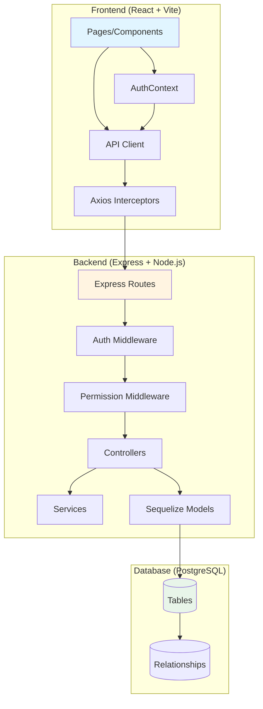

# AifyMS ERP System - Architecture Context Map

**Version:** 1.0.1  
**Last Updated:** 2025-01-27  
**Purpose:** Cognitive map for LLM understanding of system architecture, data flow, and key patterns

**Note:** This document reflects the current implementation with 38 route files, 50 models, 7 services, 58 frontend pages, and 60+ permissions.

---

## System Architecture Overview

```
┌─────────────────────────────────────────────────────────────────┐
│                         CLIENT LAYER                            │
│  ┌──────────────────────────────────────────────────────────┐  │
│  │  React 18 (Vite) Frontend                                │  │
│  │  - Pages: Dashboard, POS, Inventory, Payments, etc.      │  │
│  │  - Components: Layout, Forms, Modals                     │  │
│  │  - Context: AuthContext (User, Permissions),              │  │
│  │            NotificationContext (Notifications)           │  │
│  │  - Utils: API Client (Axios with interceptors)           │  │
│  └──────────────────────────────────────────────────────────┘  │
└─────────────────────────────────────────────────────────────────┘
                              │
                              │ HTTP/REST (JWT Bearer Token)
                              │ /api/*
                              ▼
┌─────────────────────────────────────────────────────────────────┐
│                        API LAYER                                │
│  ┌──────────────────────────────────────────────────────────┐  │
│  │  Express.js Backend (Node.js)                            │  │
│  │  - Routes: /auth, /products, /inventory, /sales, etc.    │  │
│  │  - Controllers: Business logic handlers                  │  │
│  │  - Middleware: authMiddleware, permissionMiddleware      │  │
│  │  - Services: Import/Export, Business logic               │  │
│  └──────────────────────────────────────────────────────────┘  │
└─────────────────────────────────────────────────────────────────┘
                              │
                              │ Sequelize ORM
                              │ Model Queries
                              ▼
┌─────────────────────────────────────────────────────────────────┐
│                      DATA LAYER                                 │
│  ┌──────────────────────────────────────────────────────────┐  │
│  │  PostgreSQL 15+ Database                                 │  │
│  │  - Tables: users, products, sales_orders, etc.           │  │
│  │  - Relationships: Foreign keys, Many-to-Many             │  │
│  │  - Enums: product_type, payment_status, etc.             │  │
│  └──────────────────────────────────────────────────────────┘  │
└─────────────────────────────────────────────────────────────────┘
```

### Mermaid Architecture Diagram



---

## Data Flow Explanations

### 1. Authentication Flow (Hardened)

**Path:** `Login.jsx` → `AuthContext.login()` → `POST /api/auth/login` → `authController.login()` → Database → JWT Token

**Detailed Steps:**
1. User enters credentials in `frontend/src/pages/Login.jsx`
2. Form submission calls `AuthContext.login(email, password)`
3. `AuthContext` uses `api.post('/auth/login', { email, password })` from `frontend/src/utils/api.js`
4. Axios interceptor adds `Content-Type: application/json` header
5. Request reaches `backend/src/routes/authRoutes.js` → `POST /api/auth/login`
6. `backend/src/controllers/authController.js` → `login()` function:
   - Validates email/password presence
   - Queries `User` model with `Role` and `Permission` includes
   - Calls `user.checkPassword(password)` via `passwordUtils.comparePassword()`
   - Uses **bcryptjs** (pure JS) in Docker (`USE_BCRYPT_JS=true`) for stability
   - Wraps password check in try/catch to prevent server crashes
   - Generates JWT token using `jwt.sign({ userId, email }, JWT_SECRET)`
   - Returns `{ token, user: { id, email, full_name, role, permissions, branch } }`
7. Frontend receives response:
   - Stores token in `localStorage.setItem('token', token)`
   - Stores user data in `localStorage.setItem('user', JSON.stringify(userData))`
   - Updates `AuthContext` state with user and permissions
   - Redirects to Dashboard

**Error Handling:**
- Missing credentials → 400 Bad Request
- User not found → 401 Unauthorized
- Invalid password → 401 Unauthorized
- Missing password_hash → 500 Server Error (logged for debugging)
- Bcrypt error → 500 Server Error (logged with stack trace, prevents crash)

**JWT Token Structure:**
- Payload: `{ userId: UUID, email: string }`
- Expires: 7 days (configurable via `JWT_EXPIRES_IN`)
- Secret: Stored in `JWT_SECRET` environment variable

---

### 2. API Request Flow (Authenticated)

**Path:** Component → `api.get/post/put/delete()` → Axios Interceptor → Express Route → Middleware → Controller → Sequelize → Database

**Detailed Steps:**
1. **Frontend Component** calls `api.get('/products')` or similar
2. **Axios Request Interceptor** (`frontend/src/utils/api.js`):
   - Retrieves token from `localStorage.getItem('token')`
   - Adds header: `Authorization: Bearer <token>`
   - Sets `Content-Type: application/json`
3. **Express Server** (`backend/server.js`):
   - Receives request at `/api/*`
   - Routes to appropriate route file via `backend/src/routes/index.js`
4. **Route Handler** (e.g., `backend/src/routes/productRoutes.js`):
   - Applies `authenticate` middleware
   - Applies `requirePermission` middleware (if needed)
   - Routes to controller function
5. **Auth Middleware** (`backend/src/middleware/authMiddleware.js`):
   - Extracts token from `Authorization: Bearer <token>` header
   - Verifies JWT using `jwt.verify(token, JWT_SECRET)`
   - Queries database for user with role and permissions
   - Attaches `req.user = { id, email, role_id, branch_id, permissions: [...] }`
   - Calls `next()` if valid, returns 401 if invalid
6. **Permission Middleware** (`backend/src/middleware/permissionMiddleware.js`):
   - Checks if `req.user.permissions` includes required permission slug
   - Super Admin bypasses all permission checks
   - Returns 403 if permission denied
7. **Controller** (e.g., `backend/src/controllers/productController.js`):
   - Uses `req.user` for branch filtering and authorization
   - Calls Sequelize model methods (e.g., `Product.findAll({ where: { branch_id } })`)
   - Returns JSON response
8. **Axios Response Interceptor**:
   - On 401: Clears localStorage and redirects to `/login`
   - On success: Returns response data to component
9. **Component** receives data and updates UI

---

### 3. Permission-Based Access Control Flow

**Path:** Component → `useAuth().hasPermission()` → Route Protection → API Permission Check

**Frontend Permission Check:**
- `frontend/src/context/AuthContext.jsx` provides `hasPermission(slug)` function
- Components call `const { hasPermission } = useAuth()`
- UI elements conditionally render: `{hasPermission('product_edit') && <EditButton />}`
- `ProtectedRoute` component can check permissions before rendering pages

**Backend Permission Check:**
- Routes use `requirePermission('product_edit')` middleware
- Middleware checks `req.user.permissions.includes('product_edit')`
- Super Admin role bypasses all checks (returns true for all permissions)
- Returns 403 Forbidden if permission denied

**Permission Structure:**
- 60+ total permissions organized into groups:
  - `user_management`: user_view, user_add, user_edit, user_delete, user_view_global, role_manage, agent_view, agent_add, agent_edit, agent_delete, agent_commission_view, agent_commission_manage
  - `inventory`: product_view, product_add, product_edit, product_delete, product_view_cost, stock_add_opening, stock_adjust, stock_transfer_init, stock_transfer_approve, batch_view, batch_create, batch_edit, batch_delete
  - `sales_pos`: pos_access, sale_view_own, sale_view_all, sale_edit_price, sale_discount, sale_credit, quote_manage, draft_manage, sale_return_view, sale_return_create, sale_return_approve, discount_view, discount_manage
  - `payments`: payment_view, payment_receive, payment_confirm, payment_delete_unconfirmed, payment_void_confirmed, supplier_payment, payment_account_view, payment_account_manage
  - `contacts`: customer_view, supplier_view
  - `manufacturing`: recipe_view, recipe_manage, production_view_queue, production_update_status
  - `data_management`: data_import, data_export_operational, data_export_financial
  - `reports`: report_view_register, report_view_stock_value, report_view_financial, report_view_sales
  - `expenses`: expense_view, expense_manage, expense_category_manage
  - `payroll`: payroll_view, payroll_manage
  - `purchases`: purchase_return_view, purchase_return_create, purchase_return_approve
  - `settings`: settings_manage, branch_access_all

---

### 4. Multi-Branch Data Isolation

**Pattern:** All data queries filter by `branch_id` from `req.user.branch_id`

**Implementation:**
- Users belong to a `Branch` (except Super Admin with `branch_id = NULL`)
- Controllers automatically filter queries: `Product.findAll({ where: { branch_id: req.user.branch_id } })`
- Super Admin can view all branches (no branch filter applied)
- Stock transfers require approval and track `from_branch_id` and `to_branch_id`
- Sales orders are scoped to user's branch

**Example Flow:**
1. User logs in → `req.user.branch_id = 'uuid-of-lagos-branch'`
2. Inventory query: `InventoryInstance.findAll({ where: { branch_id: req.user.branch_id } })`
3. Only shows inventory for Lagos branch
4. Super Admin: `branch_id = null` → No filter → Shows all branches

---

### 5. Inventory Instance Tracking (Coils/Pallets)

**Unique Feature:** Tracks individual physical items (coils, pallets) with unique instance codes

**Data Flow:**
1. **Register Coil:** `POST /api/inventory/instances`
   - Creates `InventoryInstance` with `instance_code` (e.g., "COIL-001")
   - Links to `Product` (any type)
   - Sets `initial_quantity` and `remaining_quantity`
   - Associates with `Branch`

2. **Sale with Coil Selection:**
   - User creates sales order with manufactured product (e.g., "Longspan 0.55")
   - System checks `Recipe` for conversion (1 Meter = 0.8 KG)
   - User must select specific `InventoryInstance` (coil) to deduct from
   - Creates `ItemAssignment` linking `SalesItem` → `InventoryInstance`
   - Deducts `quantity_deducted` from `InventoryInstance.remaining_quantity`

3. **Stock Transfer:**
   - Creates `StockTransfer` record
   - Updates `InventoryInstance.branch_id` to destination branch
   - Requires approval for inter-branch transfers

4. **Item Assignment Reversal:**
   - When a sale is cancelled or returned, `ItemAssignment` records are reversed
   - Inventory quantities are restored using precision math utilities
   - Batch status is restored from 'depleted' to 'in_stock' if quantity > 0
   - All operations are wrapped in transactions with row-level locking for data integrity

**Key Tables:**
- `inventory_instances`: Physical items with unique codes
- `item_assignments`: Links sales items to specific inventory instances (reversible on cancellation/return)
- `stock_transfers`: Tracks movement between branches
- `stock_adjustments`: Records quantity corrections with reasons

---

### 6. Gauge-Enabled Categories System

**Feature:** Dynamic gauge input configuration based on product categories

**Data Flow:**
1. **Settings Configuration:** Admin navigates to `/inventory/settings/gauges-colors`
   - Gauges tab displays checkbox list of all product categories
   - Admin toggles categories to enable/disable gauge input requirement
   - Selections saved to `business_settings.gauge_enabled_categories` (JSON array)

2. **Batch Creation with Gauge Input:**
   - User creates inventory batch via `/inventory/batches` → Create Batch modal
   - System fetches `manufacturingSettings` (includes `gauge_enabled_categories`)
   - User selects product → System checks if product's category is enabled
   - If enabled: Gauge input field appears (`<input type="number">` with `step=0.01`, `min=0.10`, `max=1.00`)
   - User enters gauge value (e.g., 0.17, 0.34) → Stored as float in `attribute_data.gauge_mm` (rounded to 2 decimals)

3. **Backend Validation:**
   - `InventoryBatch.beforeSave` hook fetches `gauge_enabled_categories` setting
   - Normalizes category name (lowercase, spaces to underscores) for comparison
   - If category enabled AND `gauge_mm` present: Validates range (0.10-1.00mm) with 2-decimal precision
   - Validation error thrown if value outside range or category mismatch

**Key Settings:**
- `business_settings.gauge_enabled_categories`: JSON array of normalized category names (e.g., `["aluminium", "stone_tile"]`)
- Legacy `manufacturing_gauges` setting has been removed; gauge input is now fully dynamic based on category toggles

**Implementation Details:**
- Category name normalization: `name.toLowerCase().replace(/\s+/g, '_')`
- Gauge values stored as floats with 2-decimal precision: `Math.round(value * 100) / 100`
- Frontend gauge input only renders when product's category matches enabled list
- Backend enforces validation only for enabled categories to prevent unnecessary errors

---

### 7. Branch-Scoped Categories & Business Settings

**Feature:** Category and business configuration data now respect branch boundaries.

**Data Flow:**
1. **Category CRUD:** `Category` records include `branch_id`. API responses automatically filter to the requesting branch plus global (null) categories. Super Admins can optionally scope queries/changes via `branch_id` query/body params.
2. **Frontend Queries:** All React Query hooks that retrieve categories or manufacturing settings include `branch_id` in both the query key and API params. Super Admin UI provides branch filters when managing categories.
3. **Business Settings:** `BusinessSetting` rows also include `branch_id` with a composite uniqueness constraint (`setting_key`, `branch_id`). GET `/settings` returns branch-specific overrides layered atop global defaults. PUT/PATCH endpoints accept an optional `branch_id` to update branch overrides while leaving global defaults intact.
4. **Validation:** Server-side helpers block branch-scoped users from reading or mutating categories/settings outside their branch, while still allowing access to global records.

**Key Implementation Details:**
- Category import/export APIs accept `branch_id`.
- Backend controllers sharing category IDs (products, inventory batches, batch settings) validate branch access before processing.
- Frontend modals default new categories to the user's branch; Super Admins can choose between global or branch-specific scope.

---

### 8. Variable Products & Variants Flow

**Feature:** Parent variable products generate child variant products based on variation combinations

**Data Flow:**
1. **Create Variable Product:** Admin creates a product with `type = 'variable'`
2. **Assign Variations:** Product linked to ProductVariations (e.g., Size, Color) via `ProductVariationAssignment`
3. **Generate Variants:** `POST /api/products/:id/generate-variants` calls `variantService.generateVariants()`
   - Fetches parent product and assigned variations with their values
   - Calculates Cartesian product of all variation value combinations
   - Creates child Product records with type `'standard'` for each combination
   - Links parent-child relationship via `ProductVariant` table
   - Generates SKU: `PARENT-SKU-VAR1-VAR2` (e.g., "TSHIRT-LG-RED")
   - Generates Name: `Parent Name - Var1 - Var2` (e.g., "T-Shirt - Large - Red")
4. **Variant Management:** 
   - Each variant is a standard product with its own inventory, pricing, stock
   - Variants can be edited, deleted individually
   - Parent product maintains list of variants via `ProductVariant` relationships

**Key Tables:**
- `product_variations`: Variation definitions (e.g., "Size", "Color")
- `product_variation_values`: Values for each variation (e.g., "Small", "Medium", "Large")
- `product_variation_assignments`: Links variable products to variations
- `product_variants`: Links parent variable product to child variant products
- `variation_combination`: JSONB field storing combination mapping (e.g., `{"Size": "Large", "Color": "Red"}`)

---

### 9. Batch Settings & Category-Batch Type Assignments Flow

**Feature:** Dynamic batch type system where batch types are assigned to categories, replacing hardcoded enum values

**Data Flow:**
1. **Create Batch Type:** Admin creates batch types (e.g., "Coil", "Pallet", "Carton") via `/inventory/settings/batches`
   - Stored in `batch_types` table
   - Can set one as default batch type
2. **Assign to Categories:** Admin assigns batch types to categories via Category-BatchType assignments
   - Stored in `category_batch_types` junction table
   - Multiple batch types can be assigned to one category
3. **Inventory Batch Creation:** When creating inventory batch:
   - System validates `batch_type_id` is assigned to product's `category_id`
   - Prevents creation of batches with invalid batch type-category combinations
   - Enforces strict material typing

**Key Tables:**
- `batch_types`: Batch type definitions with `is_default` flag
- `category_batch_types`: Many-to-many relationship between categories and batch types
- `inventory_batches`: Uses `batch_type_id` FK instead of enum

---

### 10. Units Management Flow

**Feature:** Hierarchical unit system with base units and derived units with conversion factors

**Data Flow:**
1. **Create Base Unit:** Admin creates base unit (e.g., "Kilogram", "Meter") with `is_base_unit = true`
2. **Create Derived Unit:** Admin creates derived unit (e.g., "Gram", "Centimeter")
   - Links to base unit via `base_unit_id`
   - Sets `conversion_factor` (e.g., 1000 for Gram → Kilogram)
   - System calculates conversions automatically
3. **Product Assignment:** Products link to units via `unit_id` FK
   - Supports compound unit conversions during manufacturing

**Key Tables:**
- `units`: Unit definitions with self-referential `base_unit_id`
- `products`: Links to units via `unit_id`

---

### 11. Categories Management Flow

**Feature:** Hierarchical category system with parent-child relationships and attribute schemas

**Data Flow:**
1. **Create Category:** Admin creates category with optional `parent_id` for hierarchy
2. **Attribute Schema:** Categories can have `attribute_schema` JSONB field defining allowed attributes
3. **Branch Scoping:** Categories can be branch-specific (`branch_id`) or global (`branch_id = null`)
4. **Category Usage:** Products, InventoryBatches link to categories
   - Gauge-enabled categories control gauge input requirement
   - Batch type assignments are category-scoped

**Key Tables:**
- `categories`: Category definitions with `parent_id` for hierarchy, `branch_id` for scoping, `attribute_schema` for metadata

---

### 12. Ledger Entry Flow

**Feature:** Unified ledger system tracking all financial transactions for customers and suppliers

**Data Flow:**
1. **Payment Confirmation:** When payment is confirmed:
   - Creates `LedgerEntry` with `transaction_type = 'PAYMENT'`
   - Links to `Payment` via `transaction_id`
   - Updates `Customer.ledger_balance` atomically
2. **Invoice Creation:** When sales order is created:
   - Creates `LedgerEntry` with `transaction_type = 'INVOICE'`
   - Updates customer balance
3. **Returns/Adjustments:** Similar ledger entries for returns, adjustments, refunds
4. **Ledger Queries:** 
   - `GET /api/ledger/customer/:id` returns chronological ledger entries
   - Supports filtering by date range, transaction type
   - Export to CSV/PDF available

**Key Tables:**
- `ledger_entries`: All financial transactions with `contact_type` ('customer'/'supplier'), `contact_id`, `transaction_type`, `amount`, `balance_after`
- Links to `Payment`, `SalesOrder`, etc. via polymorphic `transaction_id` pattern

---

### 13. Notification System Flow

**Feature:** In-app notification system for discount approvals and other events

**Data Flow:**
1. **Notification Creation:** System creates notifications for various events:
   - Discount approval requests (`type: 'discount_approval'`)
   - Payment pending confirmations
   - Other system events
2. **Notification Storage:** 
   - Stored in `notifications` table with `user_id`, `type`, `title`, `message`, `reference_type`, `reference_id`
   - `is_read` defaults to `false`, `read_at` is `null` initially
3. **Frontend Display:**
   - `NotificationContext` provides notifications and unread count
   - Auto-refetches every 30 seconds
   - Displays in TopBar component with badge count
4. **Mark as Read:**
   - `PUT /api/notifications/:id/read` marks single notification as read
   - `PUT /api/notifications/read-all` marks all user notifications as read
   - Updates `is_read = true` and `read_at = CURRENT_TIMESTAMP`

**Key Tables:**
- `notifications`: User notifications with read status tracking
- Indexed on `user_id`, `is_read`, `type`, and `created_at` for efficient queries

---

### 14. Discount Approval Workflow

**Feature:** Maker-checker workflow for sales discounts requiring approval

**Data Flow:**
1. **Discount Request:** When a sale is created with a discount:
   - `SalesOrder.discount_status` set to `'pending'` if discount exceeds threshold
   - `total_discount` field stores the discount amount
   - Notification created for approvers with `type: 'discount_approval'`
2. **Approval Process:**
   - Approver views pending discounts via `/discount-approvals` page
   - `GET /api/discount-approvals?status=pending` returns pending sales
   - Approver can approve or decline with reason
3. **Approval Action:**
   - `PUT /api/discount-approvals/:id/approve`:
     - Updates `discount_status = 'approved'`
     - Sets `discount_approved_by` and `discount_approved_at`
     - Creates ledger entry if customer exists
     - Updates production status to 'queue' if manufactured items exist
4. **Decline Action:**
   - `PUT /api/discount-approvals/:id/decline`:
     - Updates `discount_status = 'declined'`
     - Stores `discount_declined_reason`
5. **Restore Action:**
   - `PUT /api/discount-approvals/:id/restore`:
     - Restores declined discount back to `'pending'` status

**Key Tables:**
- `sales_orders`: Contains `discount_status`, `discount_approved_by`, `discount_approved_at`, `discount_declined_reason`, `total_discount`
- `notifications`: Created for discount approval requests
- Permission: `sale_discount_approve` required to view/approve discounts

---

## Technology Stack

### Frontend
- **Framework:** React 18 with Vite
- **Styling:** Tailwind CSS
- **State Management:** React Context API (AuthContext)
- **Data Fetching:** React Query (TanStack Query)
- **HTTP Client:** Axios with interceptors
- **Routing:** React Router v6
- **Build Tool:** Vite
- **Port:** 5173

### Backend
- **Runtime:** Node.js
- **Framework:** Express.js
- **ORM:** Sequelize
- **Authentication:** JWT (jsonwebtoken)
- **Password Hashing:** passwordUtils abstraction (bcryptjs in Docker, native bcrypt locally)
- **Validation:** Express built-in + custom
- **Port:** 5000

### Database
- **Engine:** PostgreSQL 15+
- **Connection:** Sequelize ORM
- **Port:** 5432
- **Database Name:** aify_erp
- **Schema Management:** `database/init.sql` (manual, not auto-sync)

### Infrastructure
- **Containerization:** Docker & Docker Compose
- **Network:** Bridge network (`aify-network`)
- **Volumes:** Persistent PostgreSQL data volume

---

## Key Database Models & Relationships

### Core Models
- **User** → belongsTo Role, Branch; hasMany SalesOrder (creator), Payment (created_by, confirmed_by), LedgerEntry (creator), ActivityLog
- **Role** → belongsToMany Permission (through `role_permissions`); hasMany User
- **Permission** → belongsToMany Role (through `role_permissions`)
- **Branch** → hasMany User, SalesOrder, InventoryInstance, Supplier, Purchase, ExpenseCategory, Expense, PayrollRecord, ActivityLog; hasMany Category (branch-scoped)
- **Customer** → hasMany SalesOrder, Payment; hasMany LedgerEntry (contact_type: 'customer') (global, not branch-filtered)
- **Supplier** → belongsTo Branch; hasMany Purchase, LedgerEntry (contact_type: 'supplier') (branch-filtered for non-Super Admin)
- **Product** → hasMany InventoryInstance, SalesItem, Recipe (virtual_product, raw_product), PurchaseItem, ProductVariationAssignment, ProductVariant (parent); belongsToMany Branch (through `product_business_locations`); belongsTo Unit, TaxRate, Category, ProductBrand; hasOne ProductVariant (child)
- **ProductVariation** → hasMany ProductVariationValue, ProductVariationAssignment
- **ProductVariationValue** → belongsTo ProductVariation
- **ProductVariationAssignment** → belongsTo Product, ProductVariation
- **ProductVariant** → belongsTo Product (parent_product, product)
- **Unit** → belongsTo Unit (base_unit); hasMany Unit (derived_units), Product
- **Category** → belongsTo Category (parent); belongsTo Branch; hasMany Category (children), InventoryBatch, CategoryBatchType
- **Warranty** → hasMany Product (through attribute_data)
- **BatchType** → belongsTo User (creator); hasMany CategoryBatchType, InventoryBatch
- **CategoryBatchType** → belongsTo Category, BatchType
- **InventoryBatch** → belongsTo Product, Branch, Category, BatchType; hasMany InventoryInstance
- **InventoryInstance** → belongsTo Product, Branch, InventoryBatch; hasMany ItemAssignment, PurchaseItem, StockTransfer, StockAdjustment, Wastage
- **SalesOrder** → belongsTo Customer, Branch, User; hasMany SalesItem
- **SalesItem** → belongsTo SalesOrder, Product; hasMany ItemAssignment
- **ItemAssignment** → belongsTo SalesItem, InventoryInstance
- **Recipe** → belongsTo Product (virtual_product, raw_product)
- **Payment** → belongsTo Customer, User (created_by, confirmed_by); hasMany LedgerEntry
- **Purchase** → belongsTo Supplier, Branch, User; hasMany PurchaseItem
- **PurchaseItem** → belongsTo Purchase, Product, InventoryInstance (for raw_tracked)
- **StockTransfer** → belongsTo InventoryInstance, Branch (from/to), User
- **StockAdjustment** → belongsTo InventoryInstance, User
- **Wastage** → belongsTo InventoryInstance, User
- **ExpenseCategory** → belongsTo Branch; hasMany Expense
- **Expense** → belongsTo ExpenseCategory, Branch, User (creator)
- **PayrollRecord** → belongsTo Branch, User (employee)
- **LedgerEntry** → belongsTo Customer/Supplier (contact_id with contact_type), User (creator), Payment (transaction_id)
- **ActivityLog** → belongsTo User, Branch
- **Notification** → belongsTo User (recipient)

### Product Types (Enum)
- `standard`: Regular products
- `compound`: Products with compound units
- `raw_tracked`: Raw materials tracked by instance (coils/pallets)
- `manufactured_virtual`: Virtual products created from recipes
- `variable`: Parent products that generate variant child products based on variation combinations

### Production Status (Enum)
- `queue`: Waiting for production
- `produced`: Production completed
- `delivered`: Delivered to customer
- `na`: Not applicable (standard products)

---

## Key Architectural Patterns

### 1. JWT Authentication with Bearer Tokens
- Token stored in localStorage (frontend)
- Sent in `Authorization: Bearer <token>` header
- Token contains `userId` and `email`
- User data (role, permissions) fetched on each request (not in token)
- Token expiration: 7 days

### 2. Permission Middleware Chain
```
Request → authenticate → requirePermission → Controller
```
- `authenticate`: Verifies JWT and loads user with permissions
- `requirePermission`: Checks specific permission slug
- Super Admin bypasses permission checks

### 3. Branch-Based Data Isolation
- All queries filter by `req.user.branch_id`
- Super Admin (`branch_id = null`) sees all data
- Stock transfers require explicit branch tracking

### 4. Inventory Instance Tracking
- Physical items (coils/pallets) have unique `instance_code`
- Sales link to specific instances via `ItemAssignment`
- Enables granular inventory tracking and material traceability

### 5. Manufacturing Workflow
- Sales of `manufactured_virtual` products trigger production queue
- Recipes define conversion factors (e.g., 1 Meter = 0.8 KG)
- Production status state machine: `na` → `queue` → `processing` → `produced` → `delivered` (with transactional safety and row-level locking)
- Material reservation happens at point of sale (coil selection)

### 6. Maker-Checker Workflow (Payments)
- Cashier logs payment → Status: `pending_confirmation`
- Manager confirms payment → Status: `confirmed` → Ledger updated
- Prevents unauthorized financial transactions

---

## API Endpoint Structure

### Base URL: `/api`

**Authentication:**
- `POST /api/auth/login` - User login
- `POST /api/auth/logout` - User logout (future)

**Products:**
- `GET /api/products` - List products with advanced filters (type, category, unit, tax, brand, branch, status, search, pagination)
- `POST /api/products` - Create product with business location associations
- `GET /api/products/:id` - Get product by ID with associations
- `PUT /api/products/:id` - Update product
- `DELETE /api/products/:id` - Delete product
- `PUT /api/products/:id/price` - Update product price with history tracking
- `GET /api/products/:id/price-history` - Get product price history
- `PUT /api/products/bulk-price-update` - Bulk update prices for multiple products
- `GET /api/products/:id/stock` - Get product stock across branches
- `GET /api/products/:id/sales` - Get product sales history
- `GET /api/products/:id/batches` - List inventory batches for a product
- `POST /api/products/:id/batches` - Add new batch to a product

**Inventory:**
- `GET /api/inventory/instances` - List inventory instances
- `POST /api/inventory/instances` - Register new coil/pallet
- `POST /api/inventory/transfer` - Transfer stock between branches
- `POST /api/inventory/adjust` - Adjust stock with reason

**Sales:**
- `GET /api/sales/orders` - List sales orders
- `POST /api/sales/orders` - Create sales order (POS)
- `GET /api/sales/orders/:id` - Get sales order details

**Payments:**
- `GET /api/payments` - List payments
- `POST /api/payments` - Log payment (pending confirmation)
- `PUT /api/payments/:id/confirm` - Confirm payment

**Recipes:**
- `GET /api/recipes` - List recipes
- `POST /api/recipes` - Create recipe
- `PUT /api/recipes/:id` - Update recipe

**Attributes:**
- `GET /api/attributes/brands` - List brands
- `POST /api/attributes/brands` - Create brand
- Similar for colors, gauges

**Branches:**
- `GET /api/branches` - List branches

**Customers:**
- `GET /api/customers` - List customers (global, not branch-filtered)
- `GET /api/customers/:id` - Get customer details
- `GET /api/customers/:id/ledger` - Get customer ledger/balance history
- `POST /api/customers` - Create customer
- `PUT /api/customers/:id` - Update customer
- `DELETE /api/customers/:id` - Delete customer (if no orders/payments)

**Suppliers:**
- `GET /api/suppliers` - List suppliers (branch-filtered for non-Super Admin)
- `GET /api/suppliers/:id` - Get supplier details
- `GET /api/suppliers/:id/ledger` - Get supplier ledger/balance history
- `POST /api/suppliers` - Create supplier
- `PUT /api/suppliers/:id` - Update supplier
- `DELETE /api/suppliers/:id` - Delete supplier

**Purchases:**
- `GET /api/purchases` - List purchases (branch-filtered for non-Super Admin)
- `GET /api/purchases/:id` - Get purchase details with items
- `POST /api/purchases` - Create purchase (auto-creates inventory instances for raw_tracked)
- `PUT /api/purchases/:id/status` - Update purchase status
- `DELETE /api/purchases/:id` - Delete purchase (only draft/cancelled)

**Expenses:**
- `GET /api/expenses` - List expenses (branch-filtered for non-Super Admin)
- `GET /api/expenses/:id` - Get expense details
- `POST /api/expenses` - Create expense (permission: expense_manage)
- `PUT /api/expenses/:id` - Update expense
- `DELETE /api/expenses/:id` - Delete expense
- `GET /api/expenses/summary` - Get expense summary by category
- `GET /api/expenses/categories` - List expense categories (branch-filtered)
- `POST /api/expenses/categories` - Create expense category (permission: expense_category_manage)
- `PUT /api/expenses/categories/:id` - Update expense category
- `DELETE /api/expenses/categories/:id` - Delete expense category

**Variations:**
- `GET /api/variations` - List product variations
- `POST /api/variations` - Create variation (requires `product_add`)
- `GET /api/variations/:id` - Get variation by ID
- `PUT /api/variations/:id` - Update variation (requires `product_edit`)
- `DELETE /api/variations/:id` - Delete variation (requires `product_delete`)
- `POST /api/variations/import` - Import variations from CSV/Excel
- `GET /api/variations/export` - Export variations to CSV

**Units:**
- `GET /api/units` - List units
- `POST /api/units` - Create unit (requires `product_add`)
- `GET /api/units/:id` - Get unit by ID
- `PUT /api/units/:id` - Update unit (requires `product_edit`)
- `DELETE /api/units/:id` - Delete unit (requires `product_delete`)
- `POST /api/units/import` - Import units from CSV/Excel
- `GET /api/units/export` - Export units to CSV

**Categories:**
- `GET /api/categories` - List categories (branch-scoped)
- `POST /api/categories` - Create category (requires `product_add`)
- `GET /api/categories/:id` - Get category by ID
- `PUT /api/categories/:id` - Update category (requires `product_edit`)
- `DELETE /api/categories/:id` - Delete category (requires `product_delete`)
- `POST /api/categories/import` - Import categories from CSV/Excel
- `GET /api/categories/export` - Export categories to CSV

**Warranties:**
- `GET /api/warranties` - List warranties
- `POST /api/warranties` - Create warranty (requires `product_add`)
- `GET /api/warranties/:id` - Get warranty by ID
- `PUT /api/warranties/:id` - Update warranty (requires `product_edit`)
- `DELETE /api/warranties/:id` - Delete warranty (requires `product_delete`)
- `POST /api/warranties/import` - Import warranties from CSV/Excel
- `GET /api/warranties/export` - Export warranties to CSV

**Batch Settings:**
- `GET /api/settings/batches/types` - List batch types (requires `settings_manage`)
- `POST /api/settings/batches/types` - Create batch type (requires `settings_manage`)
- `PUT /api/settings/batches/types/:id` - Update batch type (requires `settings_manage`)
- `DELETE /api/settings/batches/types/:id` - Delete batch type (requires `settings_manage`)
- `GET /api/settings/batches/types/default` - Get default batch type
- `PUT /api/settings/batches/types/:id/set-default` - Set default batch type (requires `settings_manage`)
- `GET /api/settings/batches/types/category/:categoryId` - Get batch types by category
- `GET /api/settings/batches/assignments` - Get category-batch type assignments (requires `settings_manage`)
- `POST /api/settings/batches/assignments` - Assign batch type to category (requires `settings_manage`)
- `DELETE /api/settings/batches/assignments` - Remove batch type from category (requires `settings_manage`)

**Ledger:**
- `GET /api/ledger/customer/:id` - Get customer ledger entries (requires `payment_view`)
- `GET /api/ledger/customer/:id/summary` - Get customer ledger summary (requires `payment_view`)
- `GET /api/ledger/supplier/:id` - Get supplier ledger entries (requires `product_view`)
- `GET /api/ledger/export/:type/:id` - Export ledger to CSV/PDF
- `POST /api/ledger/backfill` - Trigger historical ledger backfill (requires `settings_manage`)

**Production:**
- `POST /api/production/assign-material` - Assign material to sales item (requires `production_update_status`)
- `GET /api/production/assignments/:sales_item_id` - Get material assignments for sales item (requires `production_view_queue`)

**Products (Variable Products):**
- `POST /api/products/:id/generate-variants` - Generate variants for variable product (requires `product_edit`)
- `DELETE /api/products/:id/variants/:variantId` - Delete variant (requires `product_edit`)
- `GET /api/products/:id/variant-ledger` - Get ledger for variant (requires `product_view`)
- `GET /api/products/:id/instance-codes` - Get instance codes for product

**Import/Export:**
- Products, Inventory, Customers, Suppliers, Categories, Units, Variations, Warranties, Purchases
- Purchase import/export uses flattened format (one row per purchase item with purchase-level fields repeated)
- `POST /api/import/products` - Import products from CSV/Excel
- `GET /api/export/products` - Export products to CSV/Excel
- Similar import/export endpoints for variations, units, categories, warranties

**Notifications:**
- `GET /api/notifications` - Get user's notifications (with unread count)
- `PUT /api/notifications/:id/read` - Mark notification as read
- `PUT /api/notifications/read-all` - Mark all notifications as read

**Discount Approvals:**
- `GET /api/discount-approvals` - Get sales with discounts (pending, approved, declined)
- `PUT /api/discount-approvals/:id/approve` - Approve discount and create ledger entry
- `PUT /api/discount-approvals/:id/decline` - Decline discount with reason
- `PUT /api/discount-approvals/:id/restore` - Restore declined discount to pending

---

## Environment Variables

### Backend (`backend/src/config/env.js`)
- `NODE_ENV`: development/production
- `PORT`: 5000
- `DATABASE_URL`: PostgreSQL connection string
- `JWT_SECRET`: Secret key for JWT signing
- `JWT_EXPIRES_IN`: Token expiration (default: 7d)
- `CORS_ORIGIN`: Allowed frontend origin

### Frontend
- `VITE_API_URL`: Backend API URL (default: http://backend:5000)

---

## File Structure Reference

### Frontend (`frontend/src/`)
```
src/
├── components/          # Reusable components
│   ├── layout/         # Layout components (Sidebar, Layout)
│   ├── inventory/      # Inventory-specific components
│   ├── pos/            # POS-specific components
│   └── settings/       # Settings components
├── pages/              # Page components (routes)
├── context/            # React Context (AuthContext)
├── utils/              # Utilities (api.js)
└── App.jsx             # Main app component with routes
```

### Backend (`backend/src/`)
```
src/
├── config/             # Configuration (db.js, env.js, locale.js)
├── controllers/        # Request handlers (37 controllers)
├── models/             # Sequelize models (50 models)
├── routes/             # Express route definitions (38 route files)
├── middleware/         # Auth and permission middleware
├── services/           # Business logic services (7 services)
│   ├── exportService.js
│   ├── importService.js
│   ├── inventoryService.js
│   ├── ledgerService.js
│   ├── pdfService.js
│   ├── settingsImportExportService.js
│   └── variantService.js
├── utils/              # Utilities (passwordUtils.js, constants.js, logger.js, mathUtils.js, authHelpers.js)
└── server.js           # Express app entry point
```

### Database (`database/`)
```
database/
├── init.sql            # Schema and seed data
└── migrations/         # Database migration scripts
```

---

## Frontend UI/UX Structure

### Layout Architecture

The frontend uses a consistent layout pattern with a fixed sidebar and main content area:

```
┌─────────────────────────────────────────────────────────┐
│  Sidebar (Fixed, 256px)  │  Main Content (Flexible)    │
│  ┌─────────────────────┐  │  ┌──────────────────────┐  │
│  │ Header              │  │  │                      │  │
│  │ "Aify ERP v2.0.0"   │  │  │   Page Content       │  │
│  ├─────────────────────┤  │  │   (p-8 padding)      │  │
│  │ Navigation Menu     │  │  │                      │  │
│  │ - Dashboard         │  │  │                      │  │
│  │ - POS               │  │  │                      │  │
│  │ - Inventory         │  │  │                      │  │
│  │ - ...               │  │  │                      │  │
│  ├─────────────────────┤  │  │                      │  │
│  │ User Info           │  │  │                      │  │
│  │ Logout Button       │  │  │                      │  │
│  └─────────────────────┘  │  └──────────────────────┘  │
└─────────────────────────────────────────────────────────┘
```

**Layout Component** (`frontend/src/components/layout/Layout.jsx`):
- Flexbox layout: `flex min-h-screen bg-gray-50`
- Sidebar: Fixed width 256px (`w-64`)
- Main content: Flexible (`flex-1`) with padding (`p-8`)
- Wraps all protected routes

### Sidebar Configuration

**Location:** `frontend/src/components/layout/Sidebar.jsx`

**Structure:**
1. **Header Section:**
   - Title: "Aify ERP"
   - Version: "v2.0.0"
   - Styling: `bg-gray-900 text-white`, border-bottom

2. **Navigation Menu:**
   - Dynamic menu items filtered by permissions
   - Active route highlighting
   - Icons from `lucide-react` library

3. **Footer Section:**
   - User information (name, role, branch)
   - Logout button

**Menu Items Configuration:**
```javascript
const menuItems = [
  { name: 'Dashboard', path: '/', icon: LayoutDashboard, permission: null },
  { name: 'POS', path: '/pos', icon: ShoppingCart, permission: 'pos_access' },
  { name: 'Inventory', path: '/inventory', icon: Package, permission: 'product_view' },
  { name: 'Products', path: '/products', icon: Boxes, permission: 'product_view' },
  { name: 'Payments', path: '/payments', icon: CreditCard, permission: 'payment_view' },
  { name: 'Customers', path: '/customers', icon: UserCheck, permission: 'payment_view' },
  { name: 'Suppliers', path: '/suppliers', icon: Building2, permission: 'product_view' },
  { name: 'Users', path: '/users', icon: Users, permission: 'user_view' },
  { name: 'Settings', path: '/settings', icon: Settings, permission: 'product_add' },
  { name: 'Production Queue', path: '/production-queue', icon: Factory, permission: 'production_view_queue' },
  { name: 'Shipments', path: '/shipments', icon: Truck, permission: 'production_view_queue' },
];
```

**Permission-Based Visibility:**
- Menu items filtered using `hasPermission(item.permission)`
- Items with `permission: null` are always visible (e.g., Dashboard)
- Uses `useAuth().hasPermission()` from AuthContext
- Super Admin sees all menu items

**Active Route Highlighting:**
- Uses `useLocation()` from React Router
- Active item: `bg-primary-600 text-white`
- Inactive item: `text-gray-300 hover:bg-gray-800`
- Visual feedback on hover

**Styling:**
- Background: `bg-gray-900` (dark theme)
- Text: `text-white` for header, `text-gray-300` for menu items
- Active state: `bg-primary-600` (blue-600)
- Hover state: `hover:bg-gray-800`
- Icons: `h-5 w-5` from lucide-react
- Spacing: `space-y-2` between menu items, `px-4 py-3` for item padding

### Page Routing Structure

**Location:** `frontend/src/App.jsx`

**Route Configuration:**
- All routes except `/login` are wrapped in `<ProtectedRoute>` and `<Layout>`
- Login page is standalone (no layout)
- Catch-all route redirects to `/` (Dashboard)

**Available Pages:**
1. **Login** (`/login`) - Standalone, no layout
2. **Dashboard** (`/`) - Main dashboard with stats
3. **POS** (`/pos`) - Point of Sale interface
4. **Inventory** (`/inventory`) - Inventory management
5. **Inventory Batches** (`/inventory/batches`) - Inventory batch management
6. **Inventory Import** (`/inventory/import`) - Import products
7. **Stock Transfer** (`/inventory/stock-transfer`) - Transfer stock between branches
8. **Stock Adjustment** (`/inventory/stock-adjustment`) - Adjust stock with reasons
9. **Print Labels** (`/inventory/print-labels`) - Print labels for inventory instances
10. **Variations Settings** (`/inventory/settings/variations`) - Product variations management
11. **Units Settings** (`/inventory/settings/units`) - Units management
12. **Categories Settings** (`/inventory/settings/categories`) - Categories management
13. **Batch Settings** (`/inventory/settings/batches`) - Batch type and category-batch assignments
14. **Warranties Settings** (`/inventory/settings/warranties`) - Warranties management
16. **Products** (`/products`) - Product management
17. **Add Product** (`/products/add`) - Create new product
18. **Edit Product** (`/products/:id/edit`) - Edit existing product
19. **Update Price** (`/products/update-price`) - Bulk price update
20. **Payments** (`/payments`) - Payment processing
21. **Customers** (`/customers`) - Customer management
22. **Customer Ledger** (`/customers/:id/ledger`) - Customer ledger view
23. **Suppliers** (`/suppliers`) - Supplier management (branch-filtered)
24. **Supplier Ledger** (`/suppliers/:id/ledger`) - Supplier ledger view
25. **Import Contacts** (`/import-contacts`) - Import customers/suppliers
26. **Purchases** (`/purchases`) - Purchase order list and details
27. **Add Purchase** (`/purchases/add`) - Create purchase with inventory integration
28. **Purchase Returns** (`/purchases/returns`) - Purchase returns management
29. **Sales** (`/sales`) - Sales list
30. **Add Sale** (`/sales/add`) - Create new sale
31. **POS List** (`/sales/pos-list`) - POS transactions list
32. **Drafts** (`/sales/drafts`) - Draft sales management
33. **Quotations** (`/sales/quotations`) - Quotations management
34. **Sales Returns** (`/sales/returns`) - Sales returns management
35. **Discounts** (`/discounts`) - Discounts management
36. **Discount Approvals** (`/discount-approvals`) - Discount approval workflow
37. **Delivery Notes** (`/delivery-notes`) - Custom delivery note templates
38. **Shipments** (`/shipments`) - Shipment tracking
39. **Production Queue** (`/production-queue`) - Manufacturing queue
40. **Manufacturing Status** (`/manufacturing/status`) - Production status tracking
41. **Recipes** (`/manufacturing/recipes`) - Recipe management
42. **Expenses** (`/expenses`) - Expenses management
43. **Expense Categories** (`/expenses/categories`) - Expense categories
44. **Payroll** (`/payroll`) - Payroll management
45. **Users** (`/users`) - User management
46. **Roles** (`/roles`) - Roles & permissions management
47. **Agents** (`/agents`) - Sales commission agents
48. **Reports** (`/reports` or `/accounts/reports`) - Comprehensive reports dashboard
49. **Payment Accounts** (`/accounts/payment-accounts`) - Payment accounts management
50. **Balance Sheet** (`/accounts/payment-accounts/balance-sheet`) - Balance sheet financial statement
51. **Trial Balance** (`/accounts/payment-accounts/trial-balance`) - Trial balance financial statement
52. **Cash Flow** (`/accounts/payment-accounts/cash-flow`) - Cash flow financial statement
53. **Payment Account Report** (`/accounts/payment-accounts/report/:accountId`) - Individual account report
54. **Settings** (`/settings`) - General settings
55. **Business Settings** (`/settings/business`) - Business configuration
56. **Business Locations** (`/settings/locations`) - Multi-branch management
57. **Invoice Settings** (`/settings/invoice`) - Invoice configuration
58. **Barcode Settings** (`/settings/barcode`) - Barcode configuration
59. **Receipt Printers** (`/settings/receipt-printers`) - Receipt printer configuration
60. **Tax Rates** (`/settings/tax`) - Tax rates management

**Route Protection:**
- `ProtectedRoute` component checks authentication
- Redirects to `/login` if not authenticated
- All protected routes require valid JWT token

### UI Styling & Theme

**Tailwind CSS Configuration** (`frontend/tailwind.config.js`):
- Custom primary color palette (blue shades):
  - `primary-50` through `primary-900`
  - Default: `primary-600` (#2563eb) for buttons and active states
  - Hover: `primary-700` (#1d4ed8)

**Color Scheme:**
- **Primary:** Blue (`primary-600`, `primary-700`)
- **Background:** Light gray (`bg-gray-50`) for main content
- **Sidebar:** Dark gray (`bg-gray-900`) with white text
- **Text:** Gray scale (`text-gray-900`, `text-gray-600`, `text-gray-300`)
- **Borders:** `border-gray-300`, `border-gray-800`
- **Success/Error:** Standard Tailwind colors (red, green, yellow)

**Typography:**
- Font family: System fonts (`-apple-system, BlinkMacSystemFont, 'Segoe UI', 'Roboto'`)
- Font smoothing: Antialiased
- Headings: `font-bold`, `font-extrabold`
- Body: Default font size with responsive scaling

**Component Patterns:**
- **Buttons:** 
  - Primary: `bg-primary-600 hover:bg-primary-700 text-white`
  - Disabled: `disabled:opacity-50 disabled:cursor-not-allowed`
- **Cards:** White background with shadow and rounded corners
- **Forms:** 
  - Inputs: `border border-gray-300 focus:ring-primary-500 focus:border-primary-500`
  - Labels: `sr-only` for accessibility or visible labels
- **Loading States:** Spinner with `animate-spin` and `border-primary-600`

**Icons:**
- Library: `lucide-react`
- Common icons: LayoutDashboard, ShoppingCart, Package, Boxes, CreditCard, Users, Settings, Factory, Truck, LogOut
- Size: Typically `h-5 w-5` for menu items, `h-8 w-8` for larger displays

### Login Page Design

**Location:** `frontend/src/pages/Login.jsx`

**Layout:**
- Centered on screen: `min-h-screen flex items-center justify-center`
- Max width: `max-w-md w-full`
- Background: `bg-gray-50`
- Responsive padding: `py-12 px-4 sm:px-6 lg:px-8`

**Components:**
- Logo/Icon: Primary blue background with LogIn icon
- Title: "Aify Global ERP" (3xl, bold)
- Subtitle: "Sign in to your account"
- Form: Email and password inputs
- Error display: Red alert box for errors
- Submit button: Primary blue, full width

**Form Validation:**
- HTML5 validation (`required` attributes)
- Error state management via React state
- Loading state during authentication

### Page Component Patterns

**Common Patterns Across Pages:**
1. **Loading States:**
   - Spinner with `animate-spin`
   - Centered with `flex items-center justify-center`
   - Uses `useAuth().loading` or React Query `isLoading`

2. **Error Handling:**
   - Error messages in red alert boxes
   - Defensive rendering: `{error?.message || 'Error message'}`
   - Null checks before rendering data

3. **Data Fetching:**
   - React Query (`useQuery`) for API calls
   - Query keys for cache management
   - Automatic refetch disabled (`refetchOnWindowFocus: false`)

4. **Permission Checks:**
   - Conditional rendering: `{hasPermission('permission_slug') && <Component />}`
   - Query enabling: `enabled: hasPermission('permission')`

5. **Layout Consistency:**
   - All pages wrapped in `<Layout>` component
   - Main content area with `p-8` padding
   - Responsive design with Tailwind breakpoints

### Responsive Design

**Breakpoints (Tailwind defaults):**
- `sm`: 640px
- `md`: 768px
- `lg`: 1024px
- `xl`: 1280px
- `2xl`: 1536px

**Current Implementation:**
- Sidebar: Fixed width (not collapsible yet)
- Main content: Flexible width
- Forms: Responsive padding (`px-4 sm:px-6 lg:px-8`)
- Mobile-friendly: Touch targets sized appropriately

### Navigation Flow

**User Journey:**
1. **Unauthenticated:** Redirected to `/login`
2. **Login:** Submit credentials → JWT stored → Redirect to `/`
3. **Authenticated:** Access to all routes based on permissions
4. **Menu Navigation:** Click sidebar item → React Router navigates → Active state updates
5. **Logout:** Click logout → Clear localStorage → Redirect to `/login`

**Route Matching:**
- Exact path matching for active state
- `useLocation().pathname === item.path`
- Catch-all route (`*`) redirects to Dashboard

---

## Critical Business Logic

### Manufacturing Conversion
1. Customer orders manufactured product (e.g., "Longspan 0.55" - 100 Meters)
2. System finds Recipe: 1 Meter = 0.8 KG Coil
3. Calculates required raw material: 100 × 0.8 = 80 KG
4. User selects specific coil (InventoryInstance) with sufficient quantity
5. Creates SalesOrder with `production_status = 'queue'`
6. Production worker updates status to `processing` when materials are assigned
7. Production worker updates status to `produced` when complete (requires worker_name)
8. Dispatcher updates status to `delivered` when shipped
9. State machine enforces valid transitions with transactional safety and prevents backwards/illegal transitions

### Payment Confirmation Workflow
1. Cashier logs payment → `Payment.status = 'pending_confirmation'`
2. Manager reviews payment → `PUT /api/payments/:id/confirm`
3. System updates:
   - `Payment.status = 'confirmed'`
   - `Payment.confirmed_by = manager.user_id`
   - `Customer.ledger_balance += payment.amount`
4. Ledger balance updated atomically

### Stock Transfer Approval
1. User initiates transfer → `POST /api/inventory/transfer`
2. Creates `StockTransfer` record
3. Requires `stock_transfer_approve` permission to complete
4. Updates `InventoryInstance.branch_id` to destination branch

---

## Security Considerations

1. **JWT Tokens:** Stored in localStorage (consider httpOnly cookies for production)
2. **Password Hashing:** passwordUtils abstraction (`backend/src/utils/passwordUtils.js`)
   - Uses bcryptjs (pure JS) in Docker via `USE_BCRYPT_JS=true` env var
   - Uses native bcrypt locally for performance
   - Cost factor: 10 salt rounds
3. **SQL Injection:** Prevented by Sequelize parameterized queries
4. **XSS:** React automatically escapes content
5. **CORS:** Configured to allow only specified origin
6. **Permission Checks:** Both frontend (UI) and backend (API) enforce permissions
7. **Branch Isolation:** Data automatically filtered by user's branch

---

## Development Notes

- Database schema managed manually via `init.sql` (Sequelize sync disabled)
- Models must be associated via `associateModels()` in `backend/src/models/index.js`
- Frontend uses React Query for caching and automatic refetching
- API errors are handled by Axios interceptors (401 → logout, others → display error)
- All timestamps use PostgreSQL `TIMESTAMP` type (UTC)

---

*This document should be updated whenever architectural changes occur.*

